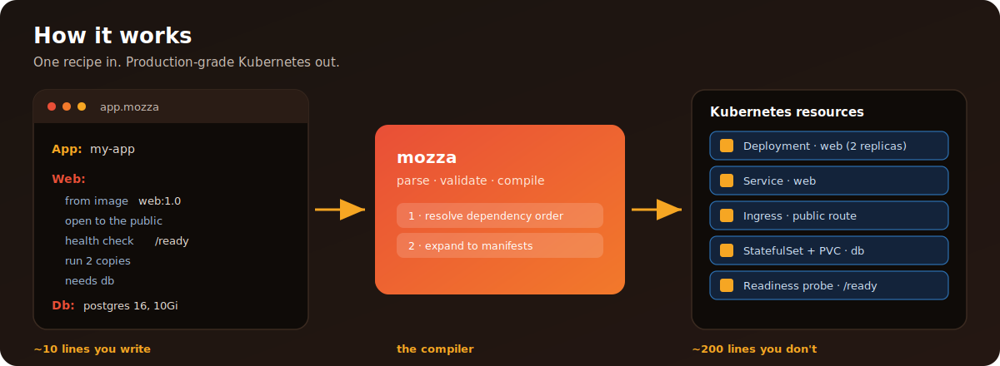

<div align="center">


[](https://go.dev)
[](https://github.com/gshepptech/mozza/releases)
[](https://github.com/gshepptech/mozza/releases)
[](LICENSE)

**Write ~10 lines of plain English. Ship production Kubernetes.**

[Quick Start](#-quick-start) · [How It Works](#-how-it-works) · [CLI](#cli-reference) · [Config](#️-configuration) · [Contributing](CONTRIBUTING.md)

</div>

> Mozza turns 200 lines of verbose Kubernetes YAML into a 10-line recipe you can actually read. You describe your app in plain language — `open to the public on port 3000`, `run 2 copies`, `needs db` — and Mozza compiles the Deployments, Services, Ingress, PVCs, and probes for you. Same recipe runs locally on Docker Compose and in production on Kubernetes.

---

## ✨ Features

| Feature | What you get |
|---|---|
| 🧾 **Recipe DSL** | Describe your stack in ~10 lines instead of 200 lines of YAML |
| 🪄 **Guided deploy wizard** | Answer plain-English questions in the web UI, get a working recipe |
| 🗃️ **Template catalog** | 10 pre-built apps (WordPress, Ghost, Gitea, and more) to deploy in one click |
| 💻 **Local & production targets** | Docker Compose locally, Kubernetes in production — same recipe |
| ↩️ **Rollback** | Revert to a previous deployment with `mozza rollback` |
| 🚦 **Environment promotion** | Move deployments from staging to production with `mozza promote` |
| 🩺 **Health checks** | `mozza doctor` diagnoses your environment and tells you what to fix |
| 🐙 **GitHub import** | Point Mozza at a repo and it infers a recipe from the codebase |
| 📊 **Web dashboard** | 20-page UI for deploys, monitoring, recipes, clusters, and teams |

---

## 🚀 Quick Start

```bash
# Install
go install github.com/gshepptech/mozza/cmd/mozza@latest

# Create a project
mozza init my-app

# Edit app.mozza to describe your stack, then bring it up
mozza up
```

That's it. No cluster setup, no Helm charts, no Ingress controllers.

### Before → After

Mozza turns this 👇

```yaml
# kubernetes deployment (abbreviated -- the real thing is longer)
apiVersion: apps/v1
kind: Deployment
metadata:
  name: web
spec:
  replicas: 2
  selector:
    matchLabels:
      app: web
  template:
    metadata:
      labels:
        app: web
    spec:
      containers:
      - name: web
        image: myorg/web:1.0.0
        ports:
        - containerPort: 3000
        readinessProbe:
          httpGet:
            path: /ready
            port: 3000
---
apiVersion: v1
kind: Service
metadata:
  name: web
spec:
  selector:
    app: web
  ports:
  - port: 3000
```

…into this 👇

```
App: my-app

Web:
  from image myorg/web:1.0.0
  open to the public on port 3000
  health check /ready
  run 2 copies
  needs db

Db:
  postgres 16, 10Gi
```

Same result. You describe what you want; Mozza figures out the infrastructure.

---

## 📦 Install

| Method | Command |
|---|---|
| 🚀 **Go install** | `go install github.com/gshepptech/mozza/cmd/mozza@latest` |
| 🐳 **Docker** | Build the included image: `docker build -t mozza .` then `docker run -p 8080:8080 -v mozza-data:/data mozza` |
| 📥 **Binaries** | Download from [GitHub Releases](https://github.com/gshepptech/mozza/releases) (linux & macOS, amd64 & arm64) |
| 🛠️ **From source** | `git clone https://github.com/gshepptech/mozza.git && cd mozza && go build -o mozza ./cmd/mozza` |

---

## 🧩 How It Works

<div align="center">



</div>

Mozza reads a `.mozza` recipe file that describes your application in plain
language. Each block (called a **slice**) defines one service — a web frontend,
an API, a database, a cache, a worker.

When you run `mozza up`, Mozza:

1. **Parses** the recipe and validates dependencies between slices
2. **Generates** the underlying infrastructure (Docker Compose locally, Kubernetes manifests for production)
3. **Deploys** everything in dependency order — databases before backends, backends before frontends
4. **Monitors** health checks and reports status

For production, `mozza deploy` pushes to a Kubernetes cluster. Mozza handles
Services, Deployments, ConfigMaps, PVCs, and Ingress resources so you don't
have to write them.

### A fuller recipe

```
App: full-stack
Namespace: production

Frontend:
  from image myorg/frontend:2.4.1
  open to the public on port 3000
  health check /ready
  run 3 copies
  domain "shop.example.com"
  needs backend

Backend:
  from image myorg/backend:1.8.0
  on port 8080
  health check /healthz
  run 4 copies
  set DATABASE_URL to "postgres://db:5432/app"
  limit cpu to "500m"
  limit memory to "512Mi"
  needs db and cache

Worker:
  from image myorg/worker:1.8.0
  run 2 copies
  needs db and cache

Db:
  postgres 16, 50Gi

Cache:
  redis 7, 1Gi
```

Each block is a slice. Lines starting with `#` are comments. Use `needs` to
declare dependencies between slices.

### The web dashboard

Run `mozza serve` and open <http://localhost:8080>. The dashboard gives you:

- A **guided wizard** that asks plain-English questions and generates a recipe
- **Deploy tracking** with status, timestamps, and logs
- A **template catalog** with 10 ready-to-deploy apps (WordPress, Ghost, Gitea, and more)
- Live **application status** with health checks and resource usage

### CLI reference

| Command | What it does |
|---|---|
| `mozza init [name]` | Scaffold a new project |
| `mozza validate` | Check the recipe file for errors |
| `mozza up` | Start the app locally (Docker Compose) |
| `mozza down` | Stop and remove the app |
| `mozza deploy` | Deploy to Kubernetes |
| `mozza status [slice]` | Show what is running |
| `mozza logs [slice]` | View logs |
| `mozza rollback` | Revert to the previous deployment |
| `mozza promote` | Promote to the next environment |
| `mozza import [file]` | Turn a Docker Compose file into a recipe |
| `mozza connect <repo>` | Connect a GitHub repo for push-to-deploy |
| `mozza recipe search <query>` | Browse the recipe catalog |
| `mozza recipe install <name>` | Download a catalog recipe |
| `mozza previews list` | Show active branch preview deployments |
| `mozza doctor` | Diagnose your environment |
| `mozza serve` | Start the web dashboard |
| `mozza version` | Print the version |

---

## 🗂️ Project Layout

| Path | What lives there |
|---|---|
| `cmd/mozza/` | CLI entrypoint (Cobra) |
| `internal/recipe/` · `internal/compile/` | Recipe parser and Kubernetes/Compose compiler |
| `internal/deploy/` · `internal/k8s/` · `internal/local/` | Deploy pipeline and target backends |
| `internal/server/` · `internal/ui/` | HTTP API and embedded web UI |
| `internal/store/` | SQLite-backed state |
| `internal/importer/` · `internal/detect/` | GitHub / Compose / Dockerfile import & framework detection |
| `internal/monitor/` · `internal/doctor/` | Health monitoring and environment diagnostics |
| `ui/` | React + Vite dashboard (20 pages) |
| `examples/` | Sample `.mozza` recipes |
| `docs/` | Getting started and production guides |

---

## ⚙️ Configuration

Mozza reads from `.mozza.yaml`, environment variables (`MOZZA_` prefix), or
built-in defaults. Config files are searched in the current directory and
`$HOME/.mozza/`.

| Variable | Config Key | Default | Description |
|----------|------------|---------|-------------|
| `MOZZA_LOG_LEVEL` | `log_level` | `info` | debug, info, warn, error |
| `MOZZA_RECIPE_FILE` | `recipe_file` | `app.mozza` | Recipe file path |
| `MOZZA_SERVER_HOST` | `server.host` | `localhost` | Dashboard bind address |
| `MOZZA_SERVER_PORT` | `server.port` | `8080` | Dashboard port |
| `MOZZA_DATABASE_PATH` | `database.path` | `mozza.db` | SQLite database path |

---

## 🧪 Development

```bash
make build     # Compile to bin/mozza
make test      # Run tests with the race detector
make lint      # Run golangci-lint
make check     # Lint + test + security checks
make clean     # Remove build artifacts
```

Requires **Go 1.24+**, **golangci-lint**, **Node.js 20+** (for the UI), and
**Docker** (for local testing). The React UI in `ui/` is built and embedded
into the Go binary via `go:embed`.

See [CONTRIBUTING.md](CONTRIBUTING.md) for the full development workflow and PR
process, [CHANGELOG.md](CHANGELOG.md) for release history, and
[SECURITY.md](SECURITY.md) to report vulnerabilities. This project follows the
[Contributor Covenant](CODE_OF_CONDUCT.md).

---

## 🗺️ Roadmap

How Mozza compares to other self-hosting tools, honestly:

| | Mozza | Coolify | Dokku | Render | Railway |
|---|---|---|---|---|---|
| Self-hosted | ✅ | ✅ | ✅ | ❌ | ❌ |
| Recipe DSL | ✅ | ❌ | ❌ | ❌ | ❌ |
| Web dashboard | ✅ | ✅ | ❌ | ✅ | ✅ |
| Kubernetes support | ✅ | ❌ | ❌ | Managed | ❌ |
| Local dev mode | ✅ | ❌ | ✅ | ❌ | ❌ |
| Template catalog | ✅ | ✅ | Plugins | ✅ | ✅ |
| GitHub import | ✅ | ✅ | ✅ | ✅ | ✅ |

**Mozza is for you when** you want to self-host on Kubernetes without writing
Kubernetes YAML, and you want one tool that works the same locally and in
production.

**It is not for you when** you need a fully managed, zero-ops platform, you are
already fluent in Kubernetes and prefer full control, or you need multi-cloud
orchestration.

---

## 📄 License

Apache-2.0 — see [LICENSE](LICENSE). © 2026 gshepptech.
